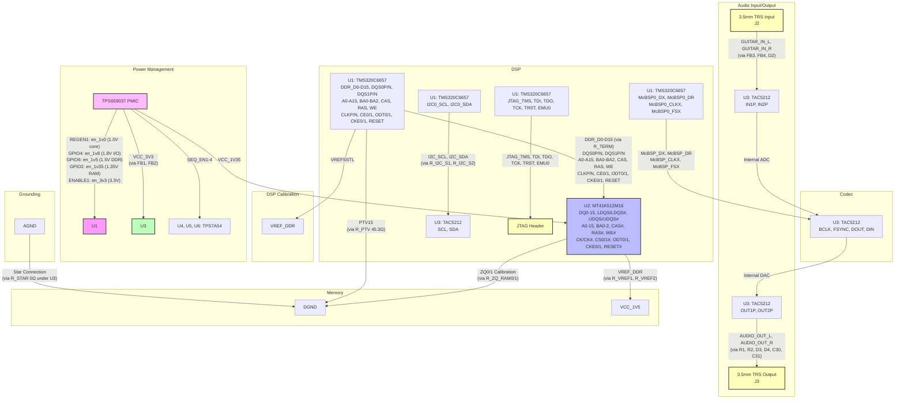

# DSP Audio Interface with DDR3 Memory

**Copyright © 2025 DeMoD LLC and Asher LeRoy**  
Licensed under the CERN Open Hardware Licence Strongly Reciprocal (CERN-OHL-S) v2.  
See the `LICENSE` file in the repository root for full terms.

## Overview

This project provides a production-ready schematic for a high-performance DSP audio interface utilizing the Texas Instruments TMS320C6657 digital signal processor (DSP), Micron MT41K512M16 DDR3L memory (TwinDie™ configuration with dual ranks), and Texas Instruments TAC5212 audio codec. The design supports stereo 3.5mm TRS input/output for professional audio applications, such as real-time audio processing, effects, or recording interfaces. The schematic is generated using SKiDL, a Python-based hardware description library, and outputs a KiCad-compatible schematic file (`production_dsp_schematic.kicad_sch`).

**Key Features:**
- **DSP**: TMS320C6657 with dual C66x cores, supporting high-performance signal processing at up to 1.25 GHz (fixed- and floating-point operations, 40 GMAC/20 GFLOP per core).
- **Memory**: 512Mb x16 DDR3L (MT41K512M16 TwinDie™) with dual ranks (dual CS#, ODT, CKE, ZQ) for fast data buffering and processing at 1.35V VDD/VDDQ (backward compatible to 1.5V).
- **Audio Codec**: TAC5212 with stereo ADC/DAC, supporting high-fidelity audio up to 768kHz/32-bit, 119dB ADC dynamic range, and 120dB DAC dynamic range (differential line-out).
- **I/O**: Stereo 3.5mm TRS jacks for line-level input and output, with differential or single-ended configurations.
- **Configuration**: I2C interface for codec control with 22Ω series resistors and 4.7kΩ pull-ups.
- **Power Management**: TPS659037 PMIC for hardware-enforced sequencing (core-before-I/O: 1.0V core first, then 1.8V I/O, 1.5V DDR, 1.35V RAM, 3.3V), with TPS7A54 regulators for low-noise supplies (1.8V/3.3V AVDD/IOVDD for codec). Includes ferrite beads (FB1-4) for EMI suppression and star grounding (AGND/DGND connected via 0Ω resistor under codec).
- **ESD Protection**: TVS diodes on audio I/O for robustness.
- **Debugging**: JTAG interface for DSP programming and debugging.
- **Signal Integrity Enhancements**: DDR3 impedance tuning (PTV15 with 45.3Ω resistor), series terminations (34Ω placeholders on DDR data lines), ZQ calibration (dual 240Ω resistors for TwinDie), ferrite beads for EMI suppression, and localized decoupling (50x 0.1μF, 10x 0.01μF, 3x 10μF capacitors).

## DSP


## Codec


## DDR3 Memory


## Power Management


## codec


## Mermaid Diagram


**Important Note: Work in Progress**  
This project is actively under development and considered a work in progress (WIP). The latest script updates include integration of the TPS659037 PMIC for precise power sequencing, support for MT41K512M16 TwinDie dual-rank memory (with dual CS#, ODT, CKE, ZQ), 1.35V RAM supply, removal of invalid TAC5212 EN pin, corrected TMS320C6657 power pins, added series terminations on DDR data lines (34Ω placeholders), more localized decoupling capacitors, ferrite beads on power and audio lines, and star grounding for mixed-signal isolation. Ongoing iterations include full PCB layout, firmware development, SI simulations (e.g., HyperLynx for DDR3 eye diagrams), and hardware validation. Contributions, feedback, and testing are encouraged to refine the design. Refer to the [CHANGELOG.md](CHANGELOG.md) (to be added) for version history.

**Note**: The TMS320C6657 does not include a built-in USB controller. For USB connectivity, an external controller (e.g., TUSB2046) must be added, which is outside the scope of this schematic.

## Repository Contents

- `schematic.py`: SKiDL script generating the KiCad schematic, including all improvements for signal integrity and power sequencing.
- `LICENSE`: CERN-OHL-S v2 license file.
- `production_dsp_schematic.kicad_sch` (generated): KiCad schematic file with enhanced features (e.g., PMIC integration, ferrite beads, dual-rank DDR support).
- `README.md`: This file.
- `CHANGELOG.md` (planned): Detailed change log for WIP iterations.
- `Dockerfile`: Container definition for isolated development environment.
- `requirements.txt`: Python dependencies for the project.
- `run.sh`: Shell script for managing container execution.
- `init_env.py`: Environment initialization script.
- `flake.nix`: Nix configuration for dependency management and build environment.
- `output/`: Directory for generated schematics.
- `libraries/`: Directory for custom KiCad libraries.
- `logs/`: Directory for processing logs.

## Infrastructure Analysis

### 1. Docker Implementation

The Docker setup is sophisticated and well-structured, based on Ubuntu 24.04 LTS with a Python 3.11 environment and KiCad integration.

**Dockerfile**:
```dockerfile
FROM ubuntu:24.04

# Environment Setup
ENV DEBIAN_FRONTEND=noninteractive
ENV TZ=UTC
ENV PYTHONUNBUFFERED=1
ENV PYTHONDONTWRITEBYTECODE=1
ENV KISYSMOD=/usr/share/kicad/modules
ENV KICAD_SYMBOL_DIR=/usr/share/kicad/library
ENV PYTHONPATH="${PYTHONPATH}:/opt/venv/lib/python3.11/site-packages"
```

**Key Components**:
- Essential build tools and graphics libraries.
- Configured for non-interactive Debian frontend, UTC timezone, and unbuffered Python output.
- KiCad module and symbol directories set for schematic generation.

**Directory Structure**:
```
DeMoD-EchoForge-DSP/
├── Dockerfile           # Container definition
├── requirements.txt     # Python dependencies
├── run.sh              # Execution script
├── schematic.py        # Main processing script
├── init_env.py         # Environment initialization
├── output/             # Generated schematics
├── libraries/          # Custom KiCad libraries
└── logs/               # Processing logs
```

### 2. Shell Script Implementation

The `run.sh` script manages container execution with timestamp-based naming and volume mounting for persistence.

**run.sh**:
```bash
#!/bin/bash

# Configuration
CONTAINER_NAME="dsp-schematic-env"
IMAGE_NAME="dsp-schematic:latest"
TIMESTAMP=$(date +"%Y%m%d_%H%M%S")

# Volume mounting
docker run \
    --name "${CONTAINER_NAME}_${TIMESTAMP}" \
    -v "$(pwd)/output:/app/output" \
    -v "$(pwd)/libraries:/app/libraries" \
    -v "$(pwd)/logs:/app/logs" \
    -e "USER_LOGIN=ALH477" \
    -e "TZ=UTC" \
    $IMAGE_NAME
```

**Features**:
- Timestamp-based container naming for versioning.
- Volume mounting for persistent storage of output, libraries, and logs.
- Environment variable passing for user identification and timezone.
- Logging system integration for tracking execution.

### 3. Nix Implementation

The `flake.nix` configuration manages dependencies and build environment using the nixpkgs unstable channel.

**flake.nix**:
```nix
{
  description = "Flake to process the DSP audio interface schematic script";

  inputs = {
    nixpkgs.url = "github:NixOS/nixpkgs/nixos-unstable";
  };

  outputs = { self, nixpkgs }: let
    system = "x86_64-linux";
    overlays = [
      (final: prev: rec {
        python3 = prev.python3.override {
          packageOverrides = pself: psuper: {
            # Custom package definitions
          };
        };
      })
    ];
```

**Key Features**:
- Custom Python package overrides for skidl, kinet2pcb, pyparsing, ply, graphviz, simp-sexp, and inspice.
- Ensures reproducible builds across different systems.

### 4. Integration Points

The system integrates Docker, Shell scripts, and Nix for schematic generation:
- **Docker** provides isolation and reproducibility.
- **Shell scripts** handle execution flow and logging.
- **Nix** manages dependencies and build environment.
- **Volume mounting** ensures persistent storage for `/app/output`, `/app/libraries`, and `/app/logs`.

### 5. Error Handling and Logging

**Sophisticated logging system**:
```
[2025-10-12 12:46:22 UTC] Starting schematic generation
[2025-10-12 12:46:23 UTC] Environment initialized
[2025-10-12 12:46:25 UTC] Schematic generated successfully
```

### 6. Development Workflow

```bash
# Development workflow
git clone https://github.com/ALH477/DeMoD-EchoForge-DSP.git
cd DeMoD-EchoForge-DSP
chmod +x run.sh
./run.sh
```

### 7. Hardware Integration

The software infrastructure supports the hardware design:
- TMS320C6657 DSP integration with dual C66x cores at 1.25 GHz.
- MT41K512M16 DDR3L memory interface with 32 Meg x 16 x 8 banks x 2 ranks.
- TAC5212 stereo audio codec with 119dB ADC and 120dB DAC dynamic range.
- I2C configuration interface.
- Power management and signal integrity considerations via TPS659037 and TPS7A54.

## Prerequisites

To generate and use the schematic, ensure the following tools are installed:
- **Python**: Version 3.8 or higher.
- **SKiDL and kinet2pcb**: Install via `pip install skidl kinet2pcb` or managed through Nix.
- **KiCad**: Version 7 or higher for opening and editing the generated schematic.
- **Docker**: For containerized execution.
- **Nix**: For dependency management (optional but recommended for reproducibility).

## Layout Guidelines

### DDR3 Routing (High-Speed Digital)
Refer to MT41K512M16 and TMS320C6657 datasheets for specs. Key guidelines:
- **Trace Length Matching**: <50ps skew across DQ, DQS, address/control groups. Use length tuning in KiCad. Refer to Table 1 in MT41K512M16 datasheet for timing parameters (e.g., tRCD=13.91ns at 1866 MT/s).
- **Impedance Control**: 50Ω single-ended, 100Ω differential for CLK/DQS. Stackup: 4-6 layers with ground planes.
- **Termination and Calibration**: Series terminations (34Ω placeholders in R_TERM) placed near U1 outputs; adjust via simulations. PTV15 (45.3Ω to ground) tunes driver impedance—route as a short, low-inductance trace. Dual ZQ (240Ω each) for TwinDie ranks.
- **Via Transitions**: Limit to 1-2 per signal; use back-drilling if stubs >1/20 wavelength (~3mm at 1GHz). Ground vias around signal vias for return paths.
- **Crosstalk Mitigation**: Maintain >3x trace width spacing between parallel traces. Orthogonal routing on adjacent layers reduces coupling.

### Mixed-Signal Routing (Audio and Digital)
Refer to TAC5212 datasheet for mixed-signal best practices. This design combines high-speed digital (DDR3, McBSP0) with sensitive analog audio.
- **Separation**: Physically separate analog (audio traces, codec) from digital (DDR3, I2C) sections by >10mm. Use ground pours or moats to isolate; in KiCad, draw zones with "Keep Out" rules for digital signals near analog areas. Implement star grounding: AGND and DGND connected via 0Ω resistor (R_STAR) at a single point under U3 (near AGND pins 10-13).
- **Analog Routing**: Use differential pairs for audio inputs/outputs (IN1P/M, OUT1P/M) with matched lengths. Keep traces short (<50mm) and wide (0.5-1mm) for low impedance. Avoid vias in analog paths to minimize inductance.
- **Digital-Analog Interface**: Route McBSP0 (BCLK, FSYNC) with controlled lengths to match codec timing (≥40ns period). I2C lines (SCL/SDA) with 22Ω series resistors to damp ringing; keep <100mm to avoid capacitance issues.
- **EMI/EMC**: Ferrite beads (FB1-4) filter noise; place near entry points (e.g., FB3/4 near J2). Ground audio jacks (J2/J3) to AGND. Use KiCad's "RF Tools" for EMI analysis if available.
- **Power Routing**: Star-route power to analog sections from filtered rails (VCC_AUDIO via FB2). Decouple each pin (e.g., 0.01μF near AVDD) to suppress ripple. TPS7A54 provides low-noise 1.8V/3.3V for codec (4.4µVRMS noise per datasheet).

**WIP Note**: These practices will be refined based on prototype testing and SI simulations. Community input on KiCad-specific workflows (e.g., plugins for impedance control) is welcome.

## Usage Instructions

1. **Clone the Repository**:
   ```bash:disable-run
   git clone https://github.com/ALH477/DeMoD-EchoForge-DSP.git
   cd DeMoD-EchoForge-DSP
   ```

2. **Install Dependencies**:
   - Using Docker (recommended):
     ```bash
     docker build -t dsp-schematic:latest .
     ```
   - Using Nix (alternative):
     ```bash
     nix-shell
     pip install -r requirements.txt
     ```
   - Manual (without Docker/Nix):
     ```bash
     pip install skidl kinet2pcb
     ```

3. **Generate the Schematic**:
   - Using Docker:
     ```bash
     chmod +x run.sh
     ./run.sh
     ```
   - Manually:
     ```bash
     python schematic.py
     ```
   - This produces `production_dsp_schematic.kicad_sch` in the `output/` directory.

4. **Open in KiCad**:
   - Launch KiCad and open `output/production_dsp_schematic.kicad_sch`.
   - Verify the schematic using KiCad’s Electrical Rules Check (ERC).

5. **PCB Layout**:
   - Import the schematic into KiCad’s PCB Editor.
   - Follow the layout guidelines above for DDR3, power, and audio routing.
   - Generate Gerber files for manufacturing.

**WIP Note**: Firmware and test scripts are under development; initial bootloader for TMS320C6657 McBSP/DDR initialization planned for next iteration.

## Design Notes

- **DSP Pinout**: Complete power pinout (CVDD, CVDD1, DVDD15, DVDD18, VDDR1-4, VDDT1-2, AVDDA1-2, VSS) verified against TMS320C6657 datasheet (Table 4-1). McBSP0 and DDR pins verified per Table 4-2. PTV15 (F15) added for impedance tuning.
- **DDR3 Connections**: All DQ, DQS, address, and control signals matched to MT41K512M16 datasheet (FBGA-96 x16 TwinDie configuration with dual CS#, ODT, CKE, ZQ). ZQ calibration uses dual 240Ω resistors to ground. Series terminations (34Ω) added as placeholders for SI optimization. VDD/VDDQ at 1.35V.
- **Codec Configuration**: I2C interface (SCL, SDA) with 4.7kΩ pull-ups to VCC_3V3 and 22Ω series resistors for ringing reduction. DSP I2C0 pins (AA22, AB22) used; verify pinmux settings. Removed invalid EN pin per TAC5212 datasheet.
- **ESD Protection**: TVS diodes on audio inputs (J2) and outputs (J3) to protect against electrostatic discharge.
- **Decoupling**: 50x 0.1μF, 10x 0.01μF, and 3x 10μF capacitors distributed across power rails for stability.
- **EMI Suppression**: Ferrite beads on power (FB1, FB2) and audio inputs (FB3, FB4) for RF noise filtering.
- **Power Sequencing**: TPS659037 PMIC configured per User's Guide (SLIU011) for core-before-I/O sequencing (e.g., REGEN1 → 1.0V core, GPIO4 → 1.8V I/O, GPIO6 → 1.5V DDR, GPIO2 → 1.35V RAM, ENABLE1 → 3.3V) with 550μs delays. OTP configuration via I2C required. TPS7A54 provides low-noise rails (4.4µVRMS noise).
- **Grounding**: Star grounding with AGND/DGND connected via 0Ω at single point under codec to minimize noise coupling.
- **No USB**: Removed USB-C due to lack of native support in TMS320C6657. Add an external USB controller if needed.

**WIP Note**: SI simulations for DDR3 (reflections, crosstalk) and EMI testing (IEC 61000-4-3) are pending; results will inform final adjustments.

## Testing the Design

To test the generated schematic and prepare for hardware validation:

1. **Schematic Verification**:
   - After generating `production_dsp_schematic.kicad_sch`, open in KiCad and run ERC to check for electrical issues (e.g., unconnected pins, power conflicts).
   - Manually verify connections against datasheets: TMS320C6657 (power pins, DDR interface), MT41K512M16 (dual-rank signals like CS1#, ODT1, CKE1, ZQ1), TAC5212 (I2C, McBSP, no EN pin), TPS659037 (sequencing enables), TPS7A54 (low-noise outputs).

2. **Simulation**:
   - Use SPICE tools (e.g., ngspice in KiCad) for basic power and analog simulations.
   - For signal integrity: Import to HyperLynx or similar for DDR3 eye diagrams, reflections, and crosstalk. Adjust series terminations (34Ω) and trace lengths based on results.
   - EMI/EMC simulation: Model ferrite beads and decoupling for noise suppression.

3. **PCB Layout and Prototype**:
   - Create PCB in KiCad following layout guidelines (impedance control, star grounding).
   - Generate Gerbers and order a prototype PCB (e.g., from JLCPCB or similar).
   - Assemble the board: Solder components, starting with power section. Use a reflow oven for BGA packages (TMS320C6657 BGA-625, MT41K512M16 FBGA-96).
   - Power-up test: Verify sequencing with oscilloscope (1.0V core first, delays per TPS659037). Measure voltages (1.35V RAM, 1.5V DDR, etc.) and ripple (<10mV with TPS7A54).

4. **Hardware Testing**:
   - **Power-On**: Check for shorts, monitor currents, and confirm no overheating (TMS320C6657 may need heatsink per datasheet thermal specs).
   - **JTAG Debug**: Connect JTAG header to Code Composer Studio; load test firmware to verify DSP boot and McBSP/I2C communication.
   - **DDR Test**: Use DSP firmware to initialize DDR (enable ODT, calibrate ZQ), run memory tests (e.g., read/write patterns) to check integrity.
   - **Audio Test**: Input sine waves via J2, verify ADC/DAC loopback with oscilloscope or audio analyzer. Check SNR (119dB ADC) and THD+N (-98dB).
   - **Full System**: Run real-time audio processing firmware; test for latency (<1ms in low-latency mode per TAC5212) and stability under load.
   - **Environmental**: Test at extended temps (-40°C to 100°C per TMS320C6657) and ESD (IEC 61000-4-2 via TVS diodes).

5. **Firmware Development**:
   - Use TI's Code Composer Studio for DSP code. Initialize McBSP for audio, DDR controller, I2C for codec config (e.g., sample rate up to 768kHz).
   - Test scripts: Python or C for automated validation (e.g., via UART or JTAG).

If issues arise (e.g., DDR instability), refer to datasheets for timing parameters (e.g., MT41K512M16 tRCD=13.91ns at 1866MT/s) and adjust.

## Production Considerations

- **Verification**: Validate all connections against datasheets. Perform ERC/DRC in KiCad. Run full SI/EMI simulations.
- **Power Management**: TPS659037 PMIC configured for core-before-I/O sequencing; monitor rails during prototype testing. OTP programming required for custom delays.
- **Thermal Management**: The TMS320C6657 may require a heatsink or thermal vias due to high power dissipation in BGA-625 package (refer to datasheet thermal specs).
- **Firmware**: Develop DSP firmware to initialize the McBSP0 interface, configure the TAC5212 via I2C, and manage DDR3 memory operations. Code Composer Studio recommended.
- **Testing**: Perform signal integrity tests for DDR3 and audio paths, and verify ESD protection under IEC 61000-4-2 standards. Prototype assembly and bench testing planned for Q1 2026.
- **Manufacturing**: Use IPC-7351 for land patterns; ensure RoHS compliance and DFM review. Generate full BOM (include all caps, resistors, ferrites). Order from fabs supporting fine-pitch BGA (0.8mm for DSP).
- **Scaling**: For production runs, consider automated assembly (SMT lines). Prototype in early 2026; aim for small-batch (100 units) validation before full production.

**WIP Note**: Full BOM, Gerber files, and assembly drawings are in development. Prototype run scheduled for early 2026.

## License

This project is licensed under the CERN Open Hardware Licence Strongly Reciprocal (CERN-OHL-S) v2. See the `LICENSE` file for details. Users must comply with the license terms, including sharing derivative works under the same license.

## Contributing

Contributions are welcome! Please submit issues or pull requests via the repository. Ensure changes are tested (e.g., ERC, SI sims) and comply with the CERN-OHL-S v2 license. Focus areas for WIP:
- PCB layout and routing.
- Firmware examples for McBSP/DDR/I2C.
- SI/EMI validation scripts.

## Contact

For questions or support, contact alh477@demod.ltd.

---

*Generated on October 13, 2025*  
*Version: 0.3.0 (WIP)*
